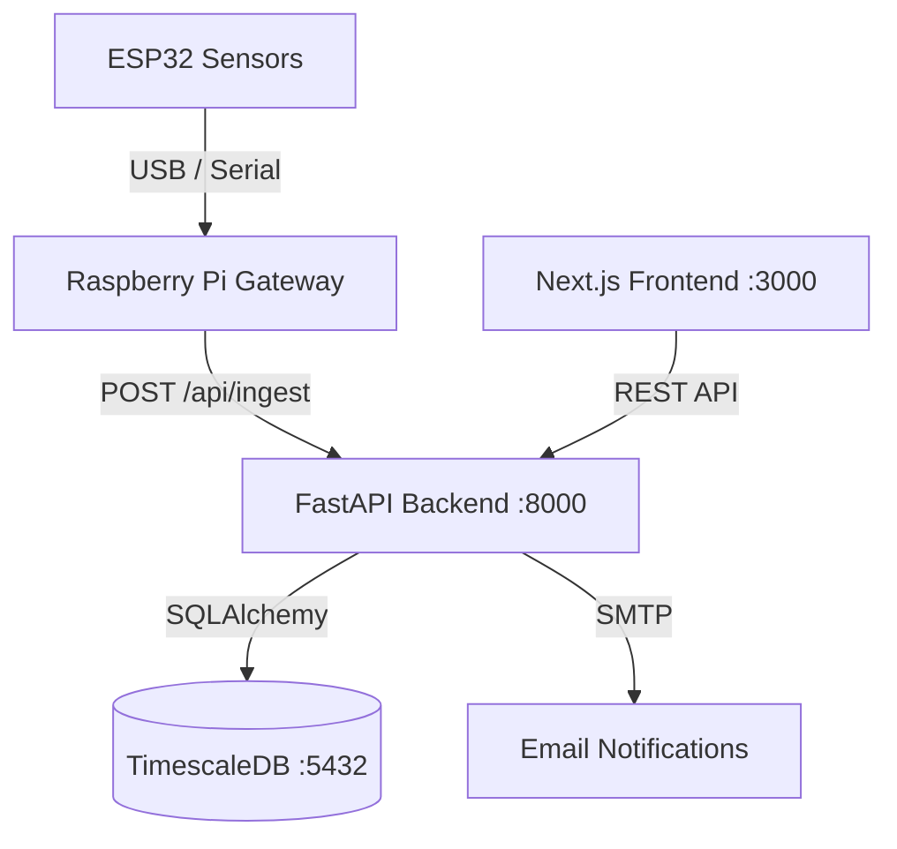

# GreenMind — Predictive Yield Optimization

> Plant bioelectrical sensing platform for greenhouse agriculture. Real-time monitoring and predictive analytics powered by ESP32 sensors, Raspberry Pi gateways, and a modern web stack.

[](https://github.com/<owner>/GreenMindDB/actions/workflows/ci.yml)

---

## Table of Contents

1. [Project Overview](#project-overview)
2. [Architecture](#architecture)
3. [Tech Stack](#tech-stack)
4. [Project Structure](#project-structure)
5. [Prerequisites](#prerequisites)
6. [Local Setup](#local-setup)
7. [Development](#development)
8. [Testing](#testing)
9. [Linting & Formatting](#linting--formatting)
10. [Build & Deployment](#build--deployment)
11. [Environment Variables](#environment-variables)
12. [Branching Strategy](#branching-strategy)
13. [Git Workflow](#git-workflow)
14. [Pull Request Rules](#pull-request-rules)
15. [CI/CD](#cicd)
16. [Troubleshooting](#troubleshooting)
17. [Security](#security)

---

## Project Overview

GreenMind is a full-stack platform for processing, storing, and analyzing **bioelectrical plant signals**. The system ingests data from ESP32 sensors via Raspberry Pi gateways into a TimescaleDB-backed FastAPI service, visualized on a modern Next.js frontend.

**Goals:**
- Real-time sensor data ingestion and visualization
- Predictive analytics for greenhouse yield optimization
- Multi-greenhouse, multi-device management
- Secure JWT-based authentication with role-based access

---

## Architecture



### Data Flow

1. **ESP32 sensors** capture bioelectrical signals from plants
2. **Raspberry Pi gateway** aggregates and forwards readings via REST
3. **FastAPI backend** validates, stores to TimescaleDB, and serves data
4. **Next.js frontend** renders real-time dashboards and management UIs

---

## Tech Stack

| Layer          | Technology                                       |
|----------------|--------------------------------------------------|
| **Frontend**   | Next.js 14, TypeScript, TailwindCSS, Recharts    |
| **Backend**    | FastAPI, SQLAlchemy, Alembic, Pydantic            |
| **Database**   | PostgreSQL 15 + TimescaleDB                       |
| **Auth**       | JWT (httpOnly cookies), bcrypt                    |
| **Deployment** | Docker Compose                                    |
| **CI/CD**      | GitHub Actions                                    |
| **Linting**    | ruff, black (Python) · ESLint, Prettier (TS)      |

---

## Project Structure

```
GreenMindDB/
├── backend/                  # FastAPI Python backend
│   ├── app/
│   │   ├── main.py           # Application entrypoint
│   │   ├── config.py         # Settings (pydantic-settings)
│   │   ├── database.py       # SQLAlchemy engine & session
│   │   ├── auth.py           # JWT, password hashing, auth deps
│   │   ├── logging_config.py # Structured logging setup
│   │   ├── models/           # SQLAlchemy ORM models
│   │   └── routers/          # API route handlers
│   ├── alembic/              # Database migrations
│   ├── scripts/              # Utility scripts (seeding, import)
│   ├── tests/                # pytest test suite
│   ├── Dockerfile
│   ├── requirements.txt
│   └── pyproject.toml        # ruff, black, pytest config
├── frontend/                 # Next.js TypeScript frontend
│   ├── src/
│   │   ├── app/              # Next.js App Router pages
│   │   ├── components/       # Reusable UI components
│   │   ├── contexts/         # React context providers
│   │   ├── hooks/            # Custom React hooks
│   │   ├── lib/              # API client, utilities
│   │   └── types/            # Shared TypeScript types
│   ├── public/               # Static assets
│   ├── Dockerfile
│   └── package.json
├── compose/                  # Production Docker Compose config
├── db/                       # Database init scripts
├── docs/                     # Project documentation
├── scripts/                  # Dev/deploy helper scripts
├── .github/                  # CI/CD, PR & issue templates
├── docker-compose.yml        # Local development compose
├── Makefile                  # Developer convenience commands
├── .env.example              # Environment template
└── README.md
```

---

## Prerequisites

- **Docker** ≥ 24.0 and **Docker Compose** ≥ 2.20
- **Python** ≥ 3.11 (for local backend development)
- **Node.js** ≥ 20 and **npm** ≥ 10 (for local frontend development)
- **Git** ≥ 2.40

---

## Local Setup

### 1. Clone the Repository

```bash
git clone <repo-url>
cd GreenMindDB
```

### 2. Configure the Environment

```bash
cp .env.example .env
```

Edit `.env` and set your values. At minimum, configure:
- `POSTGRES_PASSWORD` — a strong database password
- `JWT_SECRET_KEY` — at least 32 random characters

> **⚠️ macOS iCloud Users:** If this project is inside an iCloud-synced folder, you **must** set `PGDATA_DIR` to a path **outside** iCloud to prevent database corruption:
> ```env
> LOCAL_DATA_ROOT=/Users/yourname/LocalData/greenmind
> PGDATA_DIR=/Users/yourname/LocalData/greenmind/postgres_data
> ```

### 3. Start the Application Stack

```bash
make dev
# or: docker compose up -d --build
```

This will:
1. Pull and start the TimescaleDB database
2. Build and start the FastAPI backend (runs Alembic migrations automatically)
3. Build and start the Next.js frontend

### 4. Seed Demo Data (Optional)

```bash
docker compose exec backend python -m scripts.seed_data
```

### 5. Access the Platform

| Service               | URL                                  |
|-----------------------|--------------------------------------|
| Frontend Dashboard    | http://localhost:3000                 |
| Backend API Docs      | http://localhost:8000/docs            |
| Health Check          | http://localhost:8000/health          |

**Demo credentials:** `demo@greenmind.io` / `Demo1234`

---

## Development

### Running Individual Services

```bash
# Backend only (local Python)
cd backend
pip install -r requirements.txt
uvicorn app.main:app --reload --port 8000

# Frontend only (local Node)
cd frontend
npm install
npm run dev
```

### Useful Commands

```bash
make dev       # Start full Docker stack
make stop      # Stop all containers
make logs      # Tail container logs
make clean     # Stop + remove volumes (full reset)
make health    # Check service health
make seed      # Seed demo data
```

---

## Testing

### Backend Tests

```bash
make test
# or: cd backend && python -m pytest tests/ -v
```

Backend tests use **pytest**. Integration tests that require Docker can be skipped with:
```bash
SKIP_DOCKER_TESTS=1 pytest tests/ -v
```

### Frontend Tests

```bash
cd frontend && npm test
```

---

## Linting & Formatting

### Backend

```bash
make lint      # Run ruff linter
make format    # Format with black

# Or manually:
cd backend
python -m ruff check app/ tests/
python -m black app/ tests/
```

### Frontend

```bash
cd frontend
npm run lint      # ESLint via Next.js
npm run format    # Prettier
```

### Pre-commit Hooks (Optional)

```bash
pip install pre-commit
pre-commit install
```

This will automatically run linting and formatting checks before each commit.

---

## Build & Deployment

### Docker Build

```bash
make build     # Build all Docker images
# or: docker compose build
```

### Production Deployment

For production deployments, use the production compose file:
```bash
docker compose -f compose/docker-compose.yml --env-file compose/.env up -d
```

See `compose/` for production-specific configuration (Caddy reverse proxy, Prometheus monitoring).

---

## Environment Variables

All configuration is via environment variables. Copy `.env.example` to `.env` and customize:

| Variable                          | Description                                 | Default                       |
|-----------------------------------|---------------------------------------------|-------------------------------|
| `POSTGRES_USER`                   | Database username                           | `greenmind`                   |
| `POSTGRES_PASSWORD`               | Database password                           | *(required)*                  |
| `POSTGRES_DB`                     | Database name                               | `greenminddb`                 |
| `POSTGRES_PORT`                   | Exposed database port                       | `5432`                        |
| `BACKEND_PORT`                    | Exposed backend port                        | `8000`                        |
| `FRONTEND_PORT`                   | Exposed frontend port                       | `3000`                        |
| `CORS_ORIGINS`                    | Allowed CORS origins (comma-separated)      | `http://localhost:3000`       |
| `JWT_SECRET_KEY`                  | JWT signing key (min 32 chars)              | *(required)*                  |
| `JWT_ACCESS_TOKEN_EXPIRE_MINUTES` | Token validity in minutes                   | `10080` (7 days)              |
| `LOCAL_DATA_ROOT`                 | Local data storage root (macOS iCloud fix)  | `./data`                      |
| `PGDATA_DIR`                      | PostgreSQL data directory                   | `./postgres_data`             |
| `SMTP_HOST`                       | SMTP server for notifications               | `smtp-mail.outlook.com`       |
| `SMTP_PORT`                       | SMTP port                                   | `587`                         |
| `SMTP_USER`                       | SMTP username                               | *(optional)*                  |
| `SMTP_PASSWORD`                   | SMTP password                               | *(optional)*                  |
| `EMAIL_RECEIVER`                  | Contact form recipient email                | *(optional)*                  |

> **🔒 Never commit `.env` files with real credentials.** Use `.env.example` as a template.

---

## Branching Strategy

We use a **branch-based workflow** with two long-lived branches:

```
main ──────────────────────────────────────  (stable, production)
 └── develop ──────────────────────────────  (integration)
      ├── feature/live-sensor-stream
      ├── fix/api-validation
      ├── hotfix/login-crash
      ├── refactor/backend-services
      ├── docs/readme-update
      └── chore/update-dependencies
```

| Branch      | Purpose                                      |
|-------------|----------------------------------------------|
| `main`      | Stable, production-ready – no direct commits  |
| `develop`   | Integration branch for ongoing work           |
| `feature/*` | New functionality                             |
| `fix/*`     | Bug fixes                                     |
| `hotfix/*`  | Urgent production fixes (from `main`)         |
| `refactor/*`| Code improvements                             |
| `docs/*`    | Documentation changes                         |
| `chore/*`   | Maintenance / tooling                         |

---

## Git Workflow

### Starting a New Feature

```bash
# 1. Ensure you're up to date
git checkout develop
git pull origin develop

# 2. Create your feature branch
git checkout -b feature/my-feature

# 3. Work on your changes
# ... edit files ...

# 4. Stage and commit
git add .
git commit -m "feat: add sensor streaming endpoint"

# 5. Push to remote
git push -u origin feature/my-feature

# 6. Create a Pull Request on GitHub → target: develop
```

### Keeping Your Branch Up to Date

```bash
git fetch origin
git rebase origin/develop
```

### Creating a Release

```bash
# Merge develop into main
git checkout main
git merge develop
git tag -a v1.0.0 -m "Release 1.0.0"
git push origin main --tags
```

---

## Pull Request Rules

1. **All changes** must go through Pull Requests
2. PRs must target `develop` (never `main` directly, except hotfixes)
3. **CI must be green** before merging
4. At least **one code review approval** required
5. Use the [PR template](.github/pull_request_template.md) and fill it out completely
6. Squash-merge to keep a clean history

---

## CI/CD

GitHub Actions automatically runs on every push and PR to `main` or `develop`:

| Job          | Steps                              |
|--------------|-------------------------------------|
| **Backend**  | Install → Lint (ruff) → Format check (black) → Test (pytest) |
| **Frontend** | Install → Lint (ESLint) → Build (Next.js)                    |
| **Docker**   | Build all containers (on `main`/`develop` only)              |

Configuration: [`.github/workflows/ci.yml`](.github/workflows/ci.yml)

---

## Troubleshooting

### Containers won't start

```bash
# Check logs
docker compose logs -f

# Check specific service
docker logs -f greenminddb-backend-1
```

### Database migration errors

```bash
# Full reset: remove volumes + data directory
docker compose down -v
rm -rf /path/to/your/PGDATA_DIR
docker compose up -d --build
```

### Port conflicts

If ports 3000, 8000, or 5432 are already in use, change them in `.env`:
```env
BACKEND_PORT=8001
FRONTEND_PORT=3001
POSTGRES_PORT=5433
```

### iCloud sync issues (macOS)

PostgreSQL data **must not** be stored in an iCloud-synced folder. Set `PGDATA_DIR` to a local path outside iCloud in your `.env`.

### Backend rebuild after code changes

```bash
docker compose build backend
docker compose up -d
```

---

## Security

### Credentials

- **Never commit** `.env` files with real credentials
- Use `.env.example` as the version-controlled template
- Rotate secrets immediately if accidentally committed
- Use strong, randomly generated passwords (≥ 32 chars for JWT)

### Container Security

- All containers run with `no-new-privileges` and dropped capabilities
- Backend container runs as non-root
- Database port is bound to `127.0.0.1` (not exposed externally)

### API Security

- JWT tokens stored in **httpOnly cookies** (not localStorage)
- CORS restricted to configured origins only
- Security headers: `X-Content-Type-Options`, `X-Frame-Options`, `Referrer-Policy`
- Rate limiting on contact/public endpoints

### Recommendations

- Use **HTTPS** in production (see `compose/Caddyfile` for TLS setup)
- Enable `COOKIE_SECURE=true` in production
- Keep dependencies updated (`make update-deps`)
- Review `CODEOWNERS` when team grows

---

## API Endpoints

### Authentication
| Method | Endpoint                | Description                       |
|--------|-------------------------|-----------------------------------|
| POST   | `/api/auth/signup`      | Create new account                |
| POST   | `/api/auth/login`       | Login (sets httpOnly cookie)      |
| POST   | `/api/auth/logout`      | Logout user                       |
| GET    | `/api/auth/me`          | Get current user                  |

### Core Resources
| Method | Endpoint                           | Description                     |
|--------|------------------------------------|---------------------------------|
| GET    | `/api/organizations`               | List organizations              |
| POST   | `/api/organizations`               | Create organization             |
| GET    | `/api/greenhouses`                 | List greenhouses                |
| POST   | `/api/greenhouses`                 | Create greenhouse               |
| GET    | `/api/greenhouses/{id}/overview`   | Greenhouse dashboard overview   |
| GET    | `/api/devices`                     | List devices                    |
| POST   | `/api/devices/pairing-code`        | Generate pairing code           |
| POST   | `/api/devices/pair`                | Pair a device                   |
| GET    | `/api/sensors`                     | List sensors                    |
| GET    | `/api/sensors/{id}/data`           | Get sensor timeseries data      |

### Ingestion (IoT)
| Method | Endpoint          | Description                                    |
|--------|-------------------|------------------------------------------------|
| POST   | `/api/ingest`     | Push sensor readings (`X-Api-Key` auth)        |

### Device Pairing Flow
1. User generates a 10-minute pairing code via the dashboard
2. Raspberry Pi gateway sends `POST /api/devices/pair` with code + hardware serial
3. Backend validates, registers the device, returns an `X-Api-Key`
4. Gateway streams readings via `POST /api/ingest` using the API key
5. Live data appears on the dashboard

---

## License

*Not yet specified. Add a `LICENSE` file when ready.*
