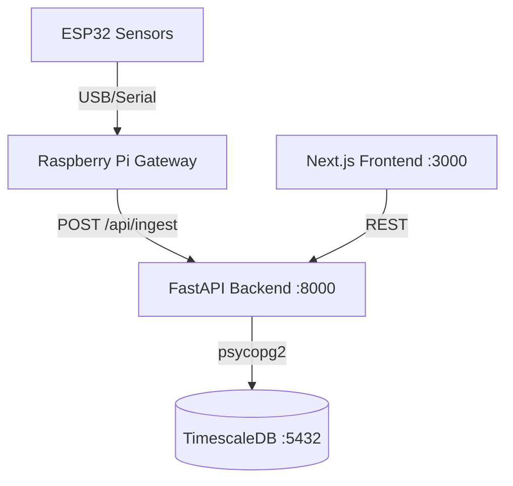

# GreenMind — Predictive Yield Optimization

Plant bioelectrical sensing system for greenhouse agriculture. This platform provides real-time monitoring and predictive analytics by ingesting data from ESP32 sensors via a Raspberry Pi Gateway into a TimescaleDB-backed FastAPI service, visualized on a modern Next.js 14 frontend.

## 🚀 Quick Start

### 1. Configure the Environment
Before starting, create your environment variables file:
```bash
cp .env.example .env
```

> **⚠️ CRITICAL for macOS iCloud Users:**
> If this project folder is synced via iCloud (e.g., inside `Mobile Documents`), you **must** configure PostgreSQL to store its data *outside* of iCloud to prevent severe database corruption and hanging containers.
> 
> Open `.env` and configure `LOCAL_DATA_ROOT` and `PGDATA_DIR` to use your local home directory. For example:
> ```env
> LOCAL_DATA_ROOT=/Users/yourusername/LocalData/greenmind
> PGDATA_DIR=/Users/yourusername/LocalData/greenmind/postgres_data
> ```

### 2. Start the Application Stack
Launch the backend api, postgres database, and frontend UI in detached mode:
```bash
docker-compose up -d --build
```
This command will:
1. Pull the TimescaleDB image and start the database.
2. Build and start the FastAPI backend (running automatic Alembic schema migrations on startup).
3. Build and start the Next.js frontend web application.

### 3. Seed Demo Data (Optional but Recommended)
To populate the database with a test organization, a sample greenhouse, devices, sensors, and a demo user account:
```bash
docker-compose exec backend python -m scripts.seed_data
```

### 4. Access the Platform
Once the startup completes and data is seeded, you can access the platform here:
- **Frontend Dashboard**: [http://localhost:3000](http://localhost:3000)
- **Backend API Docs (Swagger)**: [http://localhost:8000/docs](http://localhost:8000/docs)
- **Demo Login Credentials**: Username `demo@greenmind.io` / Password `Demo1234`

---

## 🛠 Troubleshooting & Useful Commands

**Viewing Live Logs:**
If a service is failing to start, view the logs for the specific container:
```bash
docker logs -f greenminddb-backend-1
docker logs -f greenminddb-frontend-1
```

**Completely Resetting the Application State:**
If you encounter database migration conflicts, need to clear out test data, or the backend complains about existing tables/types running migrations, you can do a full clean reset. 
*(Ensure you wipe both the Docker volumes down AND the external local bind mount!)*
```bash
docker-compose down -v
# Replace the path with your actual PGDATA_DIR location outside iCloud
rm -rf /Users/yourusername/LocalData/greenmind/postgres_data
# Restart fresh
docker-compose up -d --build
```

**Configuration Rebuilds:**
Changes to python files or `.env` configurations (like `CORS_ORIGINS`) require a rebuild of the pertinent container. Example for backend:
```bash
docker-compose build backend
docker-compose up -d
```

---

## 🏗 Architecture Overview



## 💻 Tech Stack

| Layer     | Technology                           |
|-----------|--------------------------------------|
| **Frontend**  | Next.js 14, TypeScript, TailwindCSS, Recharts |
| **Backend**   | FastAPI, SQLAlchemy, Alembic         |
| **Database**  | PostgreSQL 15 + TimescaleDB          |
| **Auth**      | JWT (httpOnly cookies), bcrypt       |
| **Deploy**    | Docker Compose                       |

---

## 🔌 API Endpoints Summary

### Authentication
- `POST /api/auth/signup` — Create a new account
- `POST /api/auth/login` — Login (sets a secure httpOnly session cookie)
- `POST /api/auth/logout` — Logout user
- `GET /api/auth/me` — Return the currently authenticated user payload

### Core Resources
- **Organizations**: `GET /api/organizations` | `POST /api/organizations`
- **Greenhouses**: `GET /api/greenhouses` | `POST /api/greenhouses` | `GET /api/greenhouses/{id}/overview`
- **Devices**: `GET /api/devices` | `POST /api/devices/pairing-code` | `POST /api/devices/pair`
- **Sensors**: `GET /api/sensors` | `GET /api/sensors/{id}/data` (with `range=24h|7d|30d`)

### Ingestion (IoT)
- `POST /api/ingest` — Push sensor readings using `X-Api-Key` authorization header.

---

## 📱 Device Pairing Flow
1. The user generates a 10-minute validity pairing code via the Next.js dashboard.
2. The deployed Raspberry Pi gateway sends a request to `POST /api/devices/pair` with the code and its unique hardware serial.
3. The backend validates the code, registers the gateway device, and immediately returns a secure `X-Api-Key`.
4. The gateway subsequently collects continuous data from the connected ESP32 agricultural sensors and streams readings via `POST /api/ingest` authenticated with the API Key.
5. Live readings appear dynamically throughout the web dashboard.
