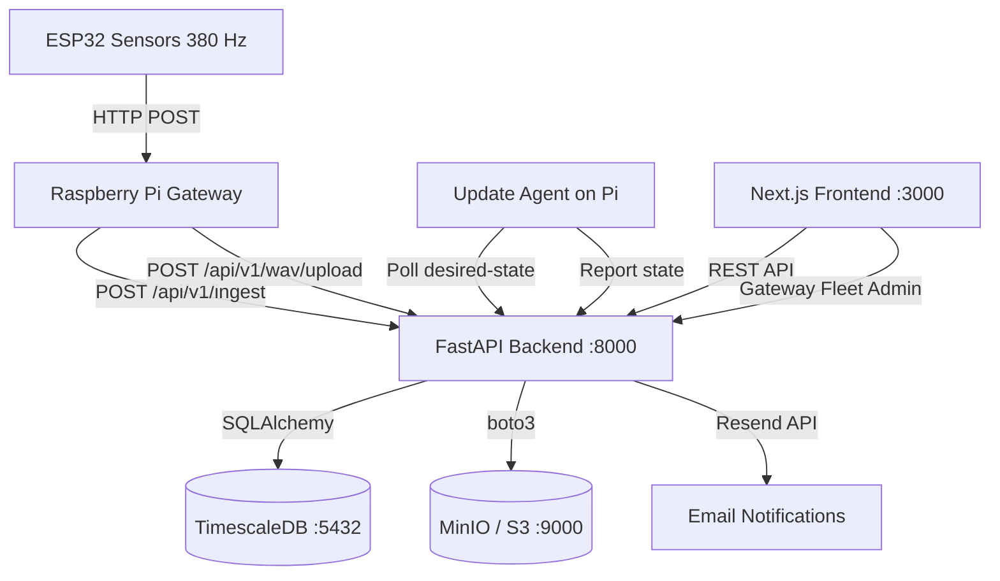

# GreenMind — R&D Framework

🎥 **Video Presentation:** [Watch our showcase at the Science Exhibition](https://youtu.be/OdKqk1Vc4Uo?si=9BqRJsJWqswzQC3o) — A short introduction to what we have discovered so far.
> Research & development platform for bioelectrical plant signal analysis — a project of **Galaxyadvisors AG** (Aarau, Switzerland) in collaboration with FHNW. Captures, aggregates, and analyzes electrophysiological plant data from ESP32 sensors via Raspberry Pi gateways, stored in TimescaleDB and visualized on a modern Next.js frontend.

> **⚠️ R&D Status:** GreenMind is in active research and development. The platform is not commercially available. Partnership inquiries for field studies and controlled experiments are welcome at [info@galaxyadvisors.com](mailto:info@galaxyadvisors.com).

[](https://github.com/Dinten-dev/GreenMindDB/actions/workflows/ci.yml)


---

## Table of Contents

1. [Project Overview](#project-overview)
2. [Features](#features)
3. [Related Repositories](#related-repositories)
4. [Architecture](#architecture)
5. [Tech Stack](#tech-stack)
6. [Project Structure](#project-structure)
7. [Prerequisites](#prerequisites)
8. [Local Setup](#local-setup)
9. [Development](#development)
10. [Testing](#testing)
11. [Linting & Formatting](#linting--formatting)
12. [Build & Deployment](#build--deployment)
13. [Environment Variables](#environment-variables)
14. [API Endpoints](#api-endpoints)
15. [Database Backup & Restore](#database-backup--restore)
16. [Branching Strategy](#branching-strategy)
17. [Git Workflow](#git-workflow)
18. [Pull Request Rules](#pull-request-rules)
19. [CI/CD](#cicd)
20. [Troubleshooting](#troubleshooting)
21. [Security](#security)
22. [Known Limitations](#known-limitations)
23. [Author & Credits](#author--credits)
24. [License](#license)

---

## Project Overview

GreenMind is a full-stack R&D platform for capturing, processing, and analyzing **bioelectrical plant signals** across diverse agricultural environments. The system ingests electrophysiological data from ESP32 sensors via Raspberry Pi gateways into a TimescaleDB-backed FastAPI service, visualized and exported through a modern Next.js frontend.

**Research Objectives:**
- Data-driven analysis of bioelectrical plant responses for stress factor identification
- Signal classification for drought, pathogen, and nutrient deficiency detection
- Hardware resilience testing under extreme agricultural conditions
- Scalable data aggregation pipeline for longitudinal studies
- Multi-zone management (Greenhouse, Open Field, Vertical Farm, Orchard) with geodata
- Secure JWT-based authentication with role-based access

---

## Features

- **Real-time biosignal streaming** — 380 Hz data capture from ESP32 sensors via WebSocket
- **Multi-zone management** — Greenhouse, Open Field, Vertical Farm, Orchard with GPS metadata
- **Interactive dashboards** — live sensor charts with configurable time ranges and resolution
- **Data export** — CSV/ZIP export per sensor with zone metadata headers
- **WAV raw data archive** — 10-minute PCM recordings stored in MinIO (S3-compatible)
- **Gateway fleet management** — OTA updates with staged rollouts (canary → early → stable)
- **Secure device pairing** — captive portal provisioning with short-lived pairing codes
- **Plant observation app** — login-free mobile observation via short-lived QR access tokens
- **Plant evaluation engine** — automated scoring based on species-specific target ranges
- **Firmware OTA** — Ed25519-signed releases with SHA256 verification and automatic rollback
- **JWT authentication** — httpOnly cookies, bcrypt password hashing, RBAC with org-scoping
- **Audit trail** — all admin actions logged with timestamps, IP, and entity references
- **Prometheus monitoring** — `/metrics` endpoint for operational observability
- **CI/CD** — GitHub Actions pipeline with automated deployment to staging and production

---

## Related Repositories

GreenMind is a multi-repo project. This repository (`GreenMindDB`) contains the cloud backend, frontend, and infrastructure. The embedded components live in separate repositories:

| Repository | Description |
|---|---|
| **[GreenMindDB](https://github.com/Dinten-dev/GreenMindDB)** (this repo) | FastAPI backend, Next.js frontend, Docker Compose, CI/CD |
| **[GreenMindRPI](https://github.com/Dinten-dev/GreenMindRPIv1)** | Raspberry Pi gateway — data aggregation, WAV recording, OTA update agent |
| **[GreenMindArdu](https://github.com/Dinten-dev/GreenMindArdu)** | ESP32 sensor firmware — 380 Hz bioelectric signal capture (Arduino C++) |

## Architecture



### Data Flow

1. **ESP32 sensors** capture bioelectrical signals at **380 Hz** with a 3-sample Moving Average filter
2. **Raspberry Pi gateway** receives 380-sample batches (1 second of data) via HTTP POST
   - **Raw samples** → written to local **WAV files** (10-minute chunks, 16-bit PCM)
   - **Aggregate** (mean of 380 samples) → queued for cloud upload
3. **Gateway WAV uploader** transfers completed WAV files to the cloud (MinIO)
4. **FastAPI backend** stores aggregates in TimescaleDB, WAV metadata in PostgreSQL, WAV files in MinIO
5. **Next.js frontend** renders real-time dashboards and provides WAV download access

---

## Tech Stack

| Layer          | Technology                                       |
|----------------|--------------------------------------------------|
| **Frontend**   | Next.js 14, TypeScript, TailwindCSS, Recharts    |
| **Backend**    | FastAPI, SQLAlchemy, Alembic, Pydantic            |
| **Database**   | PostgreSQL 15 + TimescaleDB                       |
| **Object Storage** | MinIO (S3-compatible) — WAV raw data archive  |
| **Auth**       | JWT (httpOnly cookies), bcrypt                    |
| **Email**      | Resend (transactional email API)                  |
| **OTA/Fleet**  | Desired-state agent, Ed25519 signatures, symlink releases |
| **Deployment** | Docker Compose                                    |
| **CI/CD**      | GitHub Actions                                    |
| **Linting**    | ruff, black (Python) · ESLint, Prettier (TS)      |

---

## Project Structure

```
GreenMindDB/
├── backend/                  # FastAPI Python backend
│   ├── app/
│   │   ├── main.py           # Application entrypoint
│   │   ├── config.py         # Settings (pydantic-settings)
│   │   ├── database.py       # SQLAlchemy engine & session
│   │   ├── auth.py           # JWT, password hashing, auth deps
│   │   ├── logging_config.py # Structured logging setup
│   │   ├── models/           # SQLAlchemy ORM models (Zone, Gateway, Sensor, WavFile, GatewayRemote)
│   │   ├── routers/          # API route handlers (zones, gateways, sensors, wav, gateway_admin, gateway_desired_state)
│   │   ├── schemas/          # Pydantic schemas (gateway_remote)
│   │   └── services/         # Business logic (zone, gateway, email, wav_service, gateway_remote_service)
│   ├── alembic/              # Database migrations
│   ├── scripts/              # Utility scripts (seeding, import)
│   ├── tests/                # pytest test suite
│   ├── Dockerfile
│   ├── requirements.txt
│   └── pyproject.toml        # ruff, black, pytest config
├── frontend/                 # Next.js TypeScript frontend
│   ├── src/
│   │   ├── app/              # Next.js App Router pages
│   │   │   └── app/gateway-fleet/  # Gateway Fleet Admin UI (6 tabs)
│   │   ├── components/       # Reusable UI components
│   │   ├── contexts/         # React context providers
│   │   ├── hooks/            # Custom React hooks
│   │   ├── lib/              # API client, utilities (gateway-admin-api.ts)
│   │   └── types/            # Shared TypeScript types
│   ├── public/               # Static assets
│   ├── Dockerfile
│   └── package.json
├── compose/                  # Production Docker Compose config
├── db/                       # Database init scripts
├── docs/                     # Project documentation
├── scripts/                  # Dev/deploy helper scripts
├── .github/                  # CI/CD, PR & issue templates
├── docker-compose.yml        # Local development compose
├── Makefile                  # Developer convenience commands
├── .env.example              # Environment template
└── README.md
```

---

## Prerequisites

- **Docker** ≥ 24.0 and **Docker Compose** ≥ 2.20
- **Python** ≥ 3.11 (for local backend development)
- **Node.js** ≥ 20 and **npm** ≥ 10 (for local frontend development)
- **Git** ≥ 2.40

---

## Local Setup

### 1. Clone the Repository

```bash
git clone <repo-url>
cd GreenMindDB
```

### 2. Configure the Environment

```bash
cp .env.example .env
```

Edit `.env` and set your values. At minimum, configure:
- `POSTGRES_PASSWORD` — a strong database password
- `JWT_SECRET_KEY` — at least 32 random characters

> **⚠️ macOS iCloud Users:** If this project is inside an iCloud-synced folder, you **must** set `PGDATA_DIR` to a path **outside** iCloud to prevent database corruption:
> ```env
> LOCAL_DATA_ROOT=/Users/yourname/LocalData/greenmind
> PGDATA_DIR=/Users/yourname/LocalData/greenmind/postgres_data
> ```

### 3. Start the Application Stack

```bash
make dev
# or: docker compose up -d --build
```

This will:
1. Pull and start the TimescaleDB database
2. Build and start the FastAPI backend (runs Alembic migrations automatically)
3. Build and start the Next.js frontend

### 4. Seed Demo Data (Optional)

```bash
docker compose exec backend python -m scripts.seed_data
```

### 5. Access the Platform

| Service               | URL                                  |
|-----------------------|--------------------------------------|
| Frontend Dashboard    | http://localhost:3000                 |
| Backend API Docs      | http://localhost:8000/docs            |
| Health Check          | http://localhost:8000/health          |

**Demo credentials:** `demo@greenmind.io` / `Demo1234`

---

## Development

### Running Individual Services

```bash
# Backend only (local Python)
cd backend
pip install -r requirements.txt
uvicorn app.main:app --reload --port 8000

# Frontend only (local Node)
cd frontend
npm install
npm run dev
```

### Useful Commands

```bash
make dev       # Start full Docker stack
make stop      # Stop all containers
make logs      # Tail container logs
make clean     # Stop + remove volumes (full reset)
make health    # Check service health
make seed      # Seed demo data
```

---

## Testing

### Backend Tests

The most robust way to run the entire backend test suite (unit + integration) is inside a dedicated Docker container. This ensures testing matches production dependencies without relying on local Python setups:

```bash
./scripts/run_docker_tests.sh
```

Alternatively, to run tests locally (requires Python 3.11+ and PostgreSQL libraries):
```bash
make test
# or: cd backend && python -m pytest tests/ -v
```

Integration tests that require Docker can be bypassed locally with:
```bash
SKIP_DOCKER_TESTS=1 pytest tests/ -v
```

### Frontend Tests

```bash
cd frontend && npm test
```

---

## Linting & Formatting

### Backend

```bash
make lint      # Run ruff linter
make format    # Format with black

# Or manually:
cd backend
python -m ruff check app/ tests/
python -m black app/ tests/
```

### Frontend

```bash
cd frontend
npm run lint      # ESLint via Next.js
npm run format    # Prettier
```

### Pre-commit Hooks (Optional)

```bash
pip install pre-commit
pre-commit install
```

This will automatically run linting and formatting checks before each commit.

---

## Build & Deployment (CI/CD)

GreenMind utilizes a dual-environment deployment strategy powered by **GitHub Actions** and **Docker Compose**, hosted on a Hetzner VPS.

### Environments

1. **Production** (`main` branch)
   - **URL:** [https://green-mind.ch](https://green-mind.ch)
   - **Path:** `/home/traver/greenmind-prod/`
   - **Deploy Trigger:** Push or merge to `main`

2. **Staging** (`develop` branch)
   - **URL:** [https://test.green-mind.ch](https://test.green-mind.ch) (No-Index)
   - **Path:** `/home/traver/greenmind-staging/`
   - **Deploy Trigger:** Push or merge to `develop`
   - **Constraint:** Independent databases and volumes. Safe for testing migrations.

### CI/CD Workflow

The pipeline consists of two stages:
1. **CI (Continuous Integration):** Triggered on pushes/PRs. Runs `ruff`, `black`, and `pytest` for the backend, plus `npm build` and `eslint` for the frontend.
2. **CD (Continuous Deployment):** If CI passes on `develop` or `main`, the deployment workflow executes `scripts/deploy.sh`:
   - Uses `rsync` over SSH to copy code to the appropriate environment folder on Hetzner.
   - Preserves `.env` files and Docker data volumes.
   - Starts containers using `docker-compose.prod.yml` or `docker-compose.staging.yml`.
   - Runs `smoke-test.sh` to guarantee both Frontend and Backend API are reachable.

### GitHub Secrets Required

To enable automated deployments, configure these secrets in `Settings > Secrets and variables > Actions`:
- `DEPLOY_HOST`: Set to `188.245.247.156`
- `DEPLOY_USER`: The SSH username (e.g., `traver`)
- `DEPLOY_SSH_KEY`: The **private** SSH deploy key

> **⚠️ Important:** The `.env` on the server is never overwritten by deploy.
> To change environment variables, SSH into the server and edit `/home/traver/greenmind-prod/.env` or `/home/traver/greenmind-staging/.env` directly,
> then restart the corresponding compose stack.

### Manual Local Docker Build

```bash
make build     # Build all Docker images locally
# or: docker compose build
```

---

## Environment Variables

All configuration is via environment variables. Copy `.env.example` to `.env` and customize:

| Variable                          | Description                                 | Default                       |
|-----------------------------------|---------------------------------------------|-------------------------------|
| `POSTGRES_USER`                   | Database username                           | `greenmind`                   |
| `POSTGRES_PASSWORD`               | Database password                           | *(required)*                  |
| `POSTGRES_DB`                     | Database name                               | `greenminddb`                 |
| `POSTGRES_PORT`                   | Exposed database port                       | `5432`                        |
| `BACKEND_PORT`                    | Exposed backend port                        | `8000`                        |
| `FRONTEND_PORT`                   | Exposed frontend port                       | `3000`                        |
| `CORS_ORIGINS`                    | Allowed CORS origins (comma-separated)      | `http://localhost:3000`       |
| `JWT_SECRET_KEY`                  | JWT signing key (min 32 chars)              | *(required)*                  |
| `JWT_ACCESS_TOKEN_EXPIRE_MINUTES` | Token validity in minutes                   | `10080` (7 days)              |
| `COOKIE_SECURE`                   | Set `true` in production (HTTPS)            | `false`                       |
| `LOCAL_DATA_ROOT`                 | Local data storage root (macOS iCloud fix)  | `./data`                      |
| `PGDATA_DIR`                      | PostgreSQL data directory                   | `./postgres_data`             |
| `RESEND_API_KEY`                  | Resend API key for transactional email      | *(optional)*                  |
| `EMAIL_FROM`                      | Sender address for outgoing email           | `onboarding@biolingo.org`     |
| `FRONTEND_URL`                    | Frontend URL (used in email links)          | `https://biolingo.org`        |
| `CONTACT_FORM_TO`                 | Recipient for contact/early-access emails   | *(optional)*                  |
| `S3_ENDPOINT`                     | MinIO / S3 endpoint URL                     | `http://minio:9000`           |
| `S3_REGION`                       | S3 region                                   | `eu-central-1`                |
| `S3_ACCESS_KEY_ID`                | MinIO / S3 access key                       | `minioadmin`                  |
| `S3_SECRET_ACCESS_KEY`            | MinIO / S3 secret key                       | *(required in production)*    |
| `GATEWAY_RELEASE_DIR`             | Storage path for gateway release tarballs   | `/app/firmware_data/gateway_releases` |

> **🔒 Never commit `.env` files with real credentials.** Use `.env.example` as a template.

---

## Branching Strategy

We use a **branch-based workflow** with two long-lived branches:

```
main ──────────────────────────────────────  (stable, production)
 └── develop ──────────────────────────────  (integration)
      ├── feature/live-sensor-stream
      ├── fix/api-validation
      ├── hotfix/login-crash
      ├── refactor/backend-services
      ├── docs/readme-update
      └── chore/update-dependencies
```

| Branch      | Purpose                                      |
|-------------|----------------------------------------------|
| `main`      | Stable, production-ready – no direct commits  |
| `develop`   | Integration branch for ongoing work           |
| `feature/*` | New functionality                             |
| `fix/*`     | Bug fixes                                     |
| `hotfix/*`  | Urgent production fixes (from `main`)         |
| `refactor/*`| Code improvements                             |
| `docs/*`    | Documentation changes                         |
| `chore/*`   | Maintenance / tooling                         |

---

## Git Workflow

### Starting a New Feature

```bash
# 1. Ensure you're up to date
git checkout develop
git pull origin develop

# 2. Create your feature branch
git checkout -b feature/my-feature

# 3. Work on your changes
# ... edit files ...

# 4. Stage and commit
git add .
git commit -m "feat: add sensor streaming endpoint"

# 5. Push to remote
git push -u origin feature/my-feature

# 6. Create a Pull Request on GitHub → target: develop
```

### Keeping Your Branch Up to Date

```bash
git fetch origin
git rebase origin/develop
```

### Creating a Release

```bash
# Merge develop into main
git checkout main
git merge develop
git tag -a v1.0.0 -m "Release 1.0.0"
git push origin main --tags
```

---

## Pull Request Rules

1. **All changes** must go through Pull Requests
2. PRs must target `develop` (never `main` directly, except hotfixes)
3. **CI must be green** before merging
4. At least **one code review approval** required
5. Use the [PR template](.github/pull_request_template.md) and fill it out completely
6. Squash-merge to keep a clean history

---

## CI/CD

GitHub Actions automatically runs on every push and PR to `main` or `develop`:

| Job          | Steps                              |
|--------------|-------------------------------------|
| **Backend**  | Install → Lint (ruff) → Format check (black) → Test (pytest) |
| **Frontend** | Install → Lint (ESLint) → Build (Next.js)                    |
| **Docker**   | Build all containers (on `main`/`develop` only)              |

Configuration: [`.github/workflows/ci.yml`](.github/workflows/ci.yml)

---

## Troubleshooting

### Containers won't start

```bash
# Check logs
docker compose logs -f

# Check specific service
docker logs -f greenminddb-backend-1
```

### Database migration errors

```bash
# Full reset: remove volumes + data directory
docker compose down -v
rm -rf /path/to/your/PGDATA_DIR
docker compose up -d --build
```

### Port conflicts

If ports 3000, 8000, or 5432 are already in use, change them in `.env`:
```env
BACKEND_PORT=8001
FRONTEND_PORT=3001
POSTGRES_PORT=5433
```

### iCloud sync issues (macOS)

PostgreSQL data **must not** be stored in an iCloud-synced folder. Set `PGDATA_DIR` to a local path outside iCloud in your `.env`.

### Backend rebuild after code changes

```bash
docker compose build backend
docker compose up -d
```

---

## Security

### Authentication & Access Control

- **Password hashing**: bcrypt via `passlib` with auto-configured work factor
- **Password complexity**: Backend enforces ≥8 chars, uppercase, lowercase, digit
- **JWT storage**: httpOnly + SameSite=Lax cookies only — **never** in localStorage
- **Token expiration**: Configurable via `JWT_ACCESS_TOKEN_EXPIRE_MINUTES`
- **RBAC**: All API endpoints enforce `organization_id` ownership checks (prevents IDOR)
- **Rate limiting**: Login, signup, verify-email (5/min), pairing-code, register (5/min)

### IoT / Gateway Security

- **API keys**: Each gateway receives a unique `secrets.token_urlsafe(32)` key, stored as bcrypt hash
- **Pairing codes**: 6-char, 10 min TTL, single-use, `hardware_id` uniqueness enforced
- **Sensor-gateway affinity**: Ingest rejects readings from gateways that don't own the sensor MAC
- **Idempotency**: `measurement_id` prevents duplicate data ingestion

### HTTP Security Headers

| Header | Value |
|---|---|
| `X-Content-Type-Options` | `nosniff` |
| `X-Frame-Options` | `DENY` |
| `Referrer-Policy` | `strict-origin-when-cross-origin` |
| `Content-Security-Policy` | `default-src 'self'; frame-ancestors 'none'` |
| `Permissions-Policy` | `camera=(), microphone=(), geolocation=()` |
| `Strict-Transport-Security` | `max-age=63072000` (production only) |

### Network & API

- **CORS**: Explicit origins only (no wildcards), `credentials: true`
- **Swagger/Docs**: Disabled in production (`ENVIRONMENT=production`)
- **Input validation**: Pydantic schemas on all endpoints, `EmailStr` for emails
- **Honeypot**: Contact/Early Access forms check `website` field against bots

### Container & Infrastructure

- All containers run as **non-root** users (`appuser`, `nextjs`)
- `no-new-privileges: true` and `cap_drop: ALL` on all services
- TimescaleDB bound to `127.0.0.1` only (not reachable from internet)

### Secrets Management

- **Never commit** `.env` files with real credentials
- All secrets loaded from environment variables
- JWT secret validator rejects defaults in production
- `COOKIE_SECURE` configurable via env (set `true` when HTTPS is enabled)

### OTA / Gateway Remote Management Security

- **Agent identity**: Each agent authenticates via the same `X-Api-Key` used by its gateway
- **Artifact integrity**: All release tarballs are verified by SHA256 hash before installation
- **Ed25519 signatures**: Optional code-signing verification (enforcement-ready)
- **Privilege separation**: Agent runs as unprivileged `greenmind-agent` user with restricted `sudo` (whitelist: `systemctl restart/reboot` only)
- **Offline install**: Python wheels are pre-built and installed via `pip --no-index` — no PyPI access on the Pi
- **Atomic updates**: Symlink-based release switch prevents partial installations
- **Disk pre-checks**: Agent verifies sufficient disk space (`file_size * 2 + 100 MB`) before downloading
- **Global locking**: `fcntl.flock()` prevents concurrent update/command execution
- **Update windows**: Configurable per-gateway time windows for apply phase (download allowed anytime)
- **Audit trail**: All admin actions (upload, rollout, command, rollback) are logged with timestamps, IP, and entity

---

## API Endpoints

### Authentication
| Method | Endpoint                | Description                       |
|--------|-------------------------|-----------------------------------|
| POST   | `/api/v1/auth/signup`      | Create new account                |
| POST   | `/api/v1/auth/login`       | Login (sets httpOnly cookie)      |
| POST   | `/api/v1/auth/logout`      | Logout user                       |
| GET    | `/api/v1/auth/me`          | Get current user                  |

### Core Resources
| Method | Endpoint                           | Description                     |
|--------|------------------------------------|---------------------------------|
| GET    | `/api/v1/organizations`               | List organizations              |
| POST   | `/api/v1/organizations`               | Create organization             |
| GET    | `/api/v1/zones`                       | List zones (all types)          |
| POST   | `/api/v1/zones`                       | Create zone (type, GPS)         |
| DELETE | `/api/v1/zones/{id}`                  | Delete zone + cascade           |
| GET    | `/api/v1/zones/{id}/overview`         | Zone dashboard overview         |
| GET    | `/api/v1/gateways`                    | List gateways (`?zone_id=`)     |
| POST   | `/api/v1/gateways/pairing-code`       | Generate pairing code           |
| POST   | `/api/v1/gateways/register`           | Register a gateway              |
| POST   | `/api/v1/gateways/heartbeat`          | Gateway heartbeat (X-Api-Key)   |
| GET    | `/api/v1/sensors`                     | List sensors (`?zone_id=`)      |
| GET    | `/api/v1/sensors/{id}/data`           | Get sensor timeseries data      |
| GET    | `/api/v1/sensors/{id}/export`         | Export sensor data as ZIP       |

### Ingestion (IoT)
| Method | Endpoint          | Description                                    |
|--------|-------------------|------------------------------------------------|
| POST   | `/api/v1/ingest`     | Push sensor readings (`X-Api-Key` auth)        |

### Live Data (WebSocket)
| Method | Endpoint                    | Description                             |
|--------|-----------------------------|-----------------------------------------|
| WS     | `/api/v1/ws/zone/{id}`      | Stream live sensor readings per zone    |

### Contact & Early Access
| Method | Endpoint               | Description                                    |
|--------|------------------------|------------------------------------------------|
| POST   | `/api/v1/contact`       | Submit contact form (public, rate-limited)      |
| POST   | `/api/v1/early-access`  | Submit early-access request (public)            |
| GET    | `/api/v1/submissions`   | List all form submissions (admin only)          |

> All submissions are persisted to the database as a durable backup.
> Email notifications via Resend are sent as best-effort.
> Filter by type: `GET /api/v1/submissions?form_type=early_access`

### WAV File Management
| Method | Endpoint                    | Description                                       |
|--------|-----------------------------|-------------------------------------------------|
| POST   | `/api/v1/wav/upload`          | Upload WAV file from gateway (multipart, X-Api-Key) |
| GET    | `/api/v1/wav/files`           | List WAV files (`?sensor_id=`, `?from_dt=`, `?to_dt=`) |
| GET    | `/api/v1/wav/download/{id}`   | Get presigned MinIO download URL                  |

> WAV files are 16-bit PCM, mono, 380 Hz. Each file covers a 10-minute recording
> (~456 KB). Stored in MinIO bucket `greenmind-raw` under `wav/{MAC}/{date}/{time}.wav`.

### Gateway Pairing Flow
1. User creates a **Zone** (Greenhouse, Open Field, Vertical Farm, or Orchard)
2. User generates a 10-minute pairing code for that zone via the dashboard
3. Raspberry Pi gateway sends `POST /api/v1/gateways/register` with code + hardware serial
4. Backend validates, registers the gateway to the zone, returns an `X-Api-Key`
5. Gateway sends heartbeats via `POST /api/v1/gateways/heartbeat`
6. Gateway streams readings via `POST /api/v1/ingest` using the API key
7. Live data appears on the zone dashboard via WebSocket

### Gateway Remote Management (OTA)
| Method | Endpoint                                     | Auth      | Description                               |
|--------|----------------------------------------------|-----------|-------------------------------------------|
| GET    | `/api/v1/gateway/desired-state`              | X-Api-Key | Agent polls for desired app/config version |
| POST   | `/api/v1/gateway/state-report`               | X-Api-Key | Agent reports current state + health       |
| POST   | `/api/v1/gateway/command-result`             | X-Api-Key | Agent reports command execution result     |
| GET    | `/api/v1/gateway/releases/{id}/download`     | X-Api-Key | Download release tarball                   |
| GET    | `/api/v1/gateway/configs/{id}/download`      | X-Api-Key | Download config payload                    |

### Gateway Admin (Fleet Management)
| Method | Endpoint                                     | Auth | Description                               |
|--------|----------------------------------------------|------|-------------------------------------------|
| GET    | `/api/v1/admin/gateway/fleet`                | JWT  | Fleet overview (all gateways + status)     |
| POST   | `/api/v1/admin/gateway/releases`             | JWT  | Upload new app release tarball             |
| GET    | `/api/v1/admin/gateway/releases`             | JWT  | List app releases                          |
| PATCH  | `/api/v1/admin/gateway/releases/{id}`        | JWT  | Activate/deactivate release                |
| POST   | `/api/v1/admin/gateway/configs`              | JWT  | Create config release (JSON)               |
| GET    | `/api/v1/admin/gateway/configs`              | JWT  | List config releases                       |
| PUT    | `/api/v1/admin/gateway/{id}/desired-state`   | JWT  | Set desired app/config version per gateway |
| POST   | `/api/v1/admin/gateway/{id}/command`         | JWT  | Issue remote command                       |
| POST   | `/api/v1/admin/gateway/rollout`              | JWT  | Start staged rollout to ring               |
| POST   | `/api/v1/admin/gateway/{id}/rollback`        | JWT  | Initiate rollback to previous release      |
| GET    | `/api/v1/admin/gateway/update-logs`          | JWT  | List update logs (filterable, paginated)   |
| GET    | `/api/v1/admin/gateway/audit-logs`           | JWT  | Audit trail of all admin actions           |

### OTA Update Flow
1. Admin uploads a **release tarball** (containing `src/`, `wheels/`, `requirements.lock`)
2. Admin starts a **staged rollout** targeting a ring (`canary` → `early` → `stable`)
3. Matching gateways receive the update via the **desired-state** endpoint
4. The **agent** downloads the tarball, verifies **SHA256** and optional **Ed25519 signature**
5. Agent extracts to `/opt/greenmind/releases/<version>/`, installs wheels **offline**
6. **Atomic symlink switch**: `/opt/greenmind/current` → new release
7. Agent restarts `greenmind-gateway.service` and runs a **6-point healthcheck**
8. On healthcheck failure → **automatic rollback** to previous release
9. Agent reports status back to the cloud (download/apply/rollback status)

## Database Backup & Restore

Automated bash scripts are provided to cleanly run `pg_dump` and `pg_restore` through the active TimescaleDB container.

### Backup Database
```bash
./scripts/backup_db.sh
```
This generates a timestamped `.sql` file in the `./backups` directory.

### Restore Database
```bash
./scripts/restore_db.sh ./backups/backup_YYYYMMDD_HHMMSS.sql
```
*Note: Restoration will apply the SQL dump to the current database.*

---

## Known Limitations

- **R&D status** — GreenMind is in active research and development; the platform is not commercially available
- **Single-tenant** — the current architecture supports one organization per deployment
- **No automated database backups** — backup scripts exist but must be triggered manually or via cron
- **Frontend test coverage** — Jest is configured but test coverage is minimal
- **WebSocket scaling** — the current WebSocket implementation is single-process and does not scale horizontally without a pub/sub layer
- **Offline gateway sync** — gateways queue data locally but conflict resolution for extended offline periods is not implemented

---

## Author & Credits

**Traver Dinten** 

---

## License

This project is licensed under the MIT License — see the [LICENSE](LICENSE) file for details.
