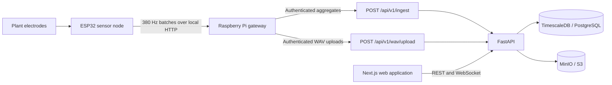

# GreenMind

GreenMind is an R&D platform for acquiring and analyzing bioelectrical plant signals. ESP32
sensor nodes send measurements through Raspberry Pi gateways to this repository's FastAPI,
TimescaleDB, MinIO, and Next.js stack.

> GreenMind is an active research system, not a commercially supported product. Never use
> example configuration unchanged in an internet-facing deployment.

[](https://github.com/Dinten-dev/GreenMindDB/actions/workflows/ci.yml)

## System architecture


```mermaid
flowchart LR
    Plant[Plant electrodes] --> Sensor[ESP32 sensor node]
    Sensor -->|380 Hz batches over local HTTP| Gateway[Raspberry Pi gateway]
    Gateway -->|Authenticated aggregates| Ingest[POST /api/v1/ingest]
    Gateway -->|Authenticated WAV uploads| Wav[POST /api/v1/wav/upload]
    Ingest --> API[FastAPI]
    Wav --> API
    API --> DB[(TimescaleDB / PostgreSQL)]
    API --> Object[(MinIO / S3)]
    UI[Next.js web application] -->|REST and WebSocket| API
```

The three deployable parts intentionally live in separate repositories:

| Repository | Runs on | Responsibility |
|---|---|---|
| [GreenMindArdu](https://github.com/Dinten-dev/GreenMindArdu) | ESP32-S3 | ADC acquisition, filtering, BLE Wi-Fi provisioning, sensor-to-gateway batches |
| [GreenMindRPI](https://github.com/Dinten-dev/GreenMindRPIv1) | Raspberry Pi | Sensor ingress, local buffering, WAV generation, cloud upload, gateway agent |
| [GreenMindDB](https://github.com/Dinten-dev/GreenMindDB) | Server / developer machine | API, web application, database, object storage, CI/CD |

The measurement flow is deliberately split by responsibility:

1. The sensor firmware samples and filters the plant signal, then sends one-second batches to
   its local gateway.
2. The gateway buffers data locally, creates WAV artifacts, and retries authenticated cloud
   uploads across network interruptions.
3. GreenMindDB stores aggregate readings in TimescaleDB, WAV metadata in PostgreSQL, and WAV
   bytes in the `greenmind-raw` MinIO bucket.
4. The frontend reads REST endpoints and zone/sensor WebSockets exposed by the backend.

Do not change a sensor payload, gateway protocol, database schema, or stored file format in one
repository without checking its consumers in the other two.

## This repository

```text
GreenMindDB/
├── backend/
│   ├── app/                 # FastAPI application, models, schemas, services, routers
│   ├── alembic/             # Canonical database migrations
│   ├── scripts/             # Explicit manual maintenance utilities only
│   ├── tests/               # pytest unit and integration tests
│   ├── Dockerfile
│   ├── pyproject.toml       # Ruff, pytest, and coverage configuration
│   ├── requirements.txt     # Pinned direct production dependencies
│   ├── requirements.lock    # Hash-locked production dependency graph
│   └── requirements-dev.txt # Pinned test/quality tools
├── frontend/
│   ├── src/                 # Next.js App Router application
│   ├── public/
│   ├── Dockerfile
│   ├── package.json
│   └── package-lock.json
├── compose/                 # Optional API-only Caddy deployment profile
├── db/                      # Database initialization required before Alembic
├── docs/                    # Architecture, deployment, and testing documentation
├── nginx/                   # Host reverse-proxy configuration for VPS deployment
├── scripts/                 # Deployment, backup, restore, smoke-test, and simulators
├── docker-compose.yml       # Canonical local full-stack definition
├── docker-compose.prod.yml  # VPS production definition
├── docker-compose.staging.yml
├── Makefile
└── .env.example
```

### Technology versions

| Layer | Current implementation |
|---|---|
| Frontend | Next.js 16.3.1, React 19, TypeScript, Node.js 24 |
| Backend | Python 3.12, FastAPI, SQLAlchemy 2, Alembic, Pydantic 2 |
| Database | TimescaleDB 2.17.2 on PostgreSQL 15 in the canonical Compose files |
| Object storage | MinIO with S3-compatible access |
| Frontend quality | ESLint 9, Prettier 3, TypeScript, Jest 30 |
| Backend quality | Ruff, pytest, coverage |
| Deployment | Docker Compose, Nginx on the VPS; optional Caddy profile under `compose/` |

## Quick start

### Prerequisites

- Docker 24 or newer with Docker Compose v2
- Git
- Python 3.12 only when running backend tools outside Docker
- Node.js 24 and npm only when running the frontend outside Docker

### Start the full local stack

```bash
git clone https://github.com/Dinten-dev/GreenMindDB.git
cd GreenMindDB
cp .env.example .env
```

Edit `.env` before starting. At minimum, replace all `CHANGE_ME` values and set:

- `POSTGRES_USER`, `POSTGRES_PASSWORD`, and `POSTGRES_DB`
- `JWT_SECRET_KEY` to a random value of at least 32 characters
- `MINIO_ROOT_USER` and `MINIO_ROOT_PASSWORD`
- `CORS_ORIGINS` and `FRONTEND_URL` for the environment
- `RESEND_API_KEY` and a verified `EMAIL_FROM` before onboarding accounts

Generate secrets with a password manager or a cryptographic generator; do not paste generated
values into source files or issue trackers.

```bash
docker compose config --quiet
make dev
make health
```

The backend applies `alembic upgrade head` before Gunicorn starts. There is no automatic demo
seed, default owner, or default administrator account.

| Service | Local address | Notes |
|---|---|---|
| Frontend | <http://localhost:3000> | Next.js application |
| API documentation | <http://localhost:8000/docs> | Development only; disabled in production |
| Health endpoint | <http://localhost:8000/health> | Backend liveness |
| MinIO API | <http://localhost:9000> | S3 endpoint; localhost-bound |
| MinIO console | <http://localhost:9001> | Local operator UI; localhost-bound |
| Prometheus | <http://localhost:9090> | Local metrics UI; localhost-bound |

Use `docker compose ps` and `docker compose logs -f <service>` if health checks do not become
ready. Local PostgreSQL, MinIO, backend, frontend, and Prometheus ports bind to `127.0.0.1`.

## Account verification and platform administration

Signup creates an unverified tenant `OWNER` and returns `AuthResponse.detail`; it does not issue
an authenticated session. The verification token must be submitted to
`POST /api/v1/auth/verify-email` before login succeeds. Configure Resend before onboarding users:
without `RESEND_API_KEY`, the account is created but the verification email is not delivered.

A tenant `OWNER` can manage resources inside its organization. Fleet-wide gateway and firmware
administration requires the platform `ADMIN` role, and signup cannot grant that role.

### One-time platform ADMIN bootstrap

There is intentionally no fixed administrator credential. First create an account normally and
verify it. Then open `psql` using the deployment's own environment:

```bash
# Canonical local/staging/production Compose files
docker compose exec postgres \
  sh -c 'exec psql -U "$POSTGRES_USER" -d "$POSTGRES_DB"'

# Optional compose/ API profile (service name differs)
docker compose -f compose/docker-compose.yml exec db \
  sh -c 'exec psql -U "$POSTGRES_USER" -d "$POSTGRES_DB"'
```

Run this interactively. Commit only if `RETURNING` shows exactly the intended active, verified
account; otherwise run `ROLLBACK;`.

```sql
BEGIN;
\prompt 'Verified account email: ' bootstrap_email
UPDATE users
SET role = 'admin'
WHERE email = lower(:'bootstrap_email')
  AND is_active IS TRUE
  AND is_verified IS TRUE
RETURNING email, role, is_active, is_verified;
-- Inspect the single returned row, then enter COMMIT; or ROLLBACK;.
```

Keep platform administrators deliberately scarce and audit every promotion.

## Developer commands

Run `make help` for the maintained command list.

| Command | Purpose |
|---|---|
| `make dev` | Build and start the canonical local stack |
| `make stop` | Stop services without deleting data |
| `make logs` | Follow all service logs |
| `make health` | Check backend, frontend, and MinIO health |
| `make build` | Build Docker images |
| `make migrate` | Apply Alembic migrations in the running backend container |
| `make test` | Run backend and frontend unit suites |
| `make test-docker` | Run the Docker-backed backend test stack |
| `make lint` | Run backend Ruff and frontend ESLint/type checks |
| `make format` | Apply Ruff formatter and Prettier to maintained source trees |
| `make format-check` | Verify formatting without changing files |
| `make clean` | Stop the stack and remove named volumes; review bind-mounted data separately |

Schema and reference data changes belong in reviewed Alembic migrations. GreenMindDB does not
ship a demo-data command because a seeded verified `OWNER` would bypass the normal account
verification lifecycle.

## Running components outside Docker

Backend:

```bash
cd backend
python3 -m venv .venv
source .venv/bin/activate
python -m pip install --require-hashes -r requirements.lock
python -m pip install -r requirements-dev.txt
uvicorn app.main:app --reload --port 8000
```

Set `DATABASE_URL` and the other backend variables first, or keep PostgreSQL and MinIO running
through Docker.

Frontend:

```bash
cd frontend
npm ci
npm run dev
```

The frontend expects the backend at `INTERNAL_API_URL` (Docker default
`http://backend:8000`).

## Testing and quality gates

The authoritative commands and fixture design are documented in [docs/testing.md](docs/testing.md).
The short form is:

```bash
make test
make lint
make format-check
```

The CI workflow runs on pushes and pull requests to `main` and `develop`:

- Python 3.12: Ruff lint, Ruff format check, non-Docker pytest suite, 60% coverage gate
- Node.js 24: `npm ci`, ESLint, Prettier check, type-check, production dependency audit,
  Next.js build, and Jest coverage

Run the Docker-backed backend tests explicitly with:

```bash
./scripts/run_docker_tests.sh
```

## Configuration

`.env.example` is the canonical root-Compose template. `compose/.env.example` belongs to the
separate API-only Caddy profile.

| Variable | Purpose |
|---|---|
| `ENVIRONMENT` | `development`, `staging`, or `production` behavior |
| `DATABASE_URL` | Backend SQLAlchemy connection when running outside root Compose |
| `POSTGRES_*` | PostgreSQL container/database configuration |
| `PGDATA_DIR`, `MINIO_DATA_DIR` | Named volumes by default; set explicit host paths only for a reviewed bind-mount deployment |
| `GREENMIND_DOCKER_SUBNET`, `GREENMIND_DOCKER_GATEWAY` | Collision-free private bridge network used to identify the trusted host proxy peer |
| `FRONTEND_PROXY_IP` | Fixed local Next.js proxy address trusted by the canonical development stack |
| `JWT_SECRET_KEY` | JWT signing secret, at least 32 characters |
| `JWT_ACCESS_TOKEN_EXPIRE_MINUTES` | Browser session lifetime; maintained default is 480 minutes (8 hours) |
| `COOKIE_SECURE`, `COOKIE_DOMAIN` | Authentication-cookie deployment settings |
| `CORS_ORIGINS` | Explicit comma-separated frontend origins |
| `MINIO_ROOT_USER`, `MINIO_ROOT_PASSWORD` | MinIO root credentials used by root Compose |
| `S3_ENDPOINT`, `S3_REGION`, `S3_ACCESS_KEY_ID`, `S3_SECRET_ACCESS_KEY` | Backend S3-compatible connection settings |
| `RESEND_API_KEY`, `EMAIL_FROM`, `FRONTEND_URL`, `CONTACT_FORM_TO` | Verification and contact email delivery |
| `ASPSMS_USERKEY`, `ASPSMS_PASSWORD`, `ASPSMS_SENDER_ID` | Optional electrode-disconnect SMS alerts |
| `GATEWAY_RELEASE_DIR` | Gateway application artifact storage |
| `GATEWAY_RELEASE_SIGNING_PUBLIC_KEY_PATH` | PEM Ed25519 public key for gateway releases |
| `ENABLE_EXPERIMENTAL_PROVISIONING` | Explicit opt-in to the experimental provisioning API |
| `ENABLE_EXPERIMENTAL_BIOSIGNAL` | Explicit opt-in to the experimental biosignal API |
| `MAX_WAV_UPLOAD_BYTES` | Per-request WAV upload limit; default 32 MiB |
| `MAX_WAV_BUNDLE_FILES`, `MAX_WAV_BUNDLE_BYTES` | Maximum files and total uncompressed bytes in one WAV download bundle |
| `SENSOR_EXPORT_MAX_ROWS`, `SENSOR_EXPORT_MAX_BYTES`, `SENSOR_EXPORT_MAX_KINDS` | Bounds for generated sensor-data archives |
| `WEBSOCKET_MAX_CONNECTIONS*` | Global, user, and IP WebSocket limits |
| `WEBSOCKET_*_TIMEOUT_SECONDS` | WebSocket idle/send timeouts |

Production and staging `.env` files live only on their hosts and are excluded from rsync.

## API boundaries

Every maintained route is under `/api/v1` except `/`, `/health`, `/metrics`, and development
OpenAPI endpoints. Important groups are:

| Prefix | Authentication | Purpose |
|---|---|---|
| `/api/v1/auth` | Public for signup/login/verify; cookie/JWT for profile | Account lifecycle |
| `/api/v1/organizations`, `/zones`, `/plants`, `/sensors`, `/gateways` | Cookie/JWT | Tenant resources and pairing |
| `/api/v1/ingest` | `X-Api-Key` | Idempotent gateway aggregate ingestion |
| `/api/v1/wav` | Gateway key for upload; JWT for tenant access | WAV upload, listing, download |
| `/api/v1/ws/zone/{id}`, `/ws/sensor/{id}` | JWT/cookie | Live views |
| `/api/v1/gateway` | `X-Api-Key` | Gateway desired state, reports, commands, releases |
| `/api/v1/admin` | Platform `ADMIN` | Fleet releases, rollout, commands, audit |
| `/api/v1/firmware` | Gateway key or platform `ADMIN`, endpoint-dependent | ESP firmware OTA metadata and reports |
| `/api/v1/public/observe`, `/public/evaluate` | Short-lived scoped tokens / public validation | Field observations |

Experimental `/api/v1/provisioning` and `/api/v1/biosignal` routes are absent unless their
explicit feature flags are enabled. Consult `/docs` in development or the router source for the
exact request and response schema.

### Gateway trust and release integrity

- Gateways receive a one-time `gmk_<gateway-id>_<secret>` API key. Only its bcrypt hash is
  stored; legacy keys remain accepted during migration/rotation.
- Gateway application activation and download fail closed unless the artifact SHA-256 is signed
  by the configured Ed25519 public key. The signing contract is the ASCII SHA-256 hexadecimal
  digest, matching the gateway agent.
- Ingest checks that sensor MAC addresses belong to the authenticated gateway and uses
  `measurement_id` for idempotency.
- Local ESP32 firmware OTA has a separate trust model in GreenMindArdu/GreenMindRPI and must not
  be inferred from the gateway application-release mechanism documented here.

## Deployment

The VPS deployment workflows run only after CI succeeds:

| Branch | Environment | Compose file |
|---|---|---|
| `develop` | staging | `docker-compose.staging.yml` |
| `main` | production | `docker-compose.prod.yml` |

The workflows require environment-scoped `DEPLOY_HOST`, `DEPLOY_USER`, `DEPLOY_SSH_KEY`, and
`DEPLOY_KNOWN_HOSTS` secrets. `scripts/deploy.sh` enforces host-key checking, rsyncs source while
preserving host `.env` and data, builds the selected Compose stack, and waits for backend and
frontend health. Run it manually only as an authorized operator with those variables supplied.

Each profile uses a distinct fixed private bridge so Gunicorn accepts `X-Forwarded-*` identity
headers only from the expected host bridge or application proxy. Before first deployment, confirm
that `GREENMIND_DOCKER_SUBNET` does not overlap a host LAN, VPN, or another Docker network. Changing
an existing deployment's subnet requires a planned recreation of that Compose network; named data
volumes remain separate and must not be deleted as part of that operation.

The optional backend-only Caddy profile is documented in
[docs/SETUP_MACMINI.md](docs/SETUP_MACMINI.md). It is not the canonical full-stack frontend
deployment.

## Backup and restore

```bash
./scripts/backup_db.sh
./scripts/restore_db.sh ./backups/greenmind_<UTC-timestamp>.sql
```

Backups are created with restrictive permissions. Restore is destructive to the selected
database: validate a backup against a disposable database first and confirm the active Compose
environment before proceeding. MinIO objects require a separate backup/replication policy.

## Security and operational limits

- Secrets are loaded from environment variables; real `.env` files, deployment keys, and
  simulator state must never be committed.
- Browser authentication uses httpOnly cookies. Login rejects inactive or unverified users.
- Tenant `OWNER` and platform `ADMIN` are different trust scopes.
- Database, MinIO, backend, frontend, and metrics ports bind to localhost in maintained Compose
  definitions; reverse proxies provide external TLS.
- Containers use non-root users where supported, drop capabilities, set PID limits, and cap log
  rotation.
- WebSocket rooms are process-local, so production keeps one backend worker until a shared
  pub/sub layer exists.
- WAV uploads are bounded, validated, content-addressed, and stored in the fixed
  `greenmind-raw` MinIO bucket; observation photos use `greenmind-photos`, and metadata remains
  in PostgreSQL.
- Database backups are manual, and MinIO has no replication configured by this repository.

Report vulnerabilities privately to the repository maintainers. Do not include credentials,
tokens, tenant data, or production measurements in an issue.

## Contributing

See [CONTRIBUTING.md](CONTRIBUTING.md) for branch and review rules. Architecture decisions live
in [docs/architecture-decisions.md](docs/architecture-decisions.md), and test commands live in
[docs/testing.md](docs/testing.md).

## License

GreenMindDB is licensed under the [MIT License](LICENSE).
