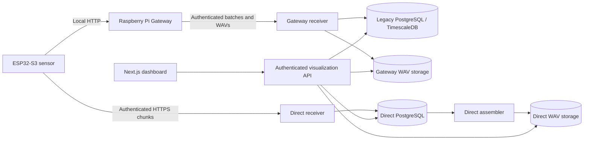

# GreenMind cloud platform

Research platform for bioelectrical plant signals: FastAPI APIs, a Next.js dashboard,
PostgreSQL/TimescaleDB and MinIO object storage. Sensors upload directly over Wi-Fi or through Raspberry Pi Gateways.

## Download and install


| Component | Download | Installation guide |
| --- | --- | --- |
| Direct-to-Cloud sensor, Production v2.8 | [Firmware ZIP](https://github.com/Dinten-dev/GreenMindArdu/releases/download/manual-2026-10-10/direct-production-2.8.zip) | [Direct USB installation](https://github.com/Dinten-dev/GreenMindArdu/blob/main/docs/direct-to-cloud.md) |
| Direct-to-Gateway sensor v1.2.0 | [Firmware ZIP](https://github.com/Dinten-dev/GreenMindArdu/releases/download/manual-2026-10-10/gateway-sensor-1.2.0.zip) | [Gateway sensor USB installation](https://github.com/Dinten-dev/GreenMindArdu/blob/main/docs/gateway-sensor.md) |
| Raspberry Pi Gateway, manual maintenance candidate | [Installer-free maintenance ZIP](https://github.com/Dinten-dev/GreenMindRPIv1/releases/download/manual-2026-10-10/gateway-maintenance-2026-10-10.zip) | [Gateway installation and maintenance](https://github.com/Dinten-dev/GreenMindRPIv1/blob/main/docs/gateway-installation.md) |
| Cloud backend and dashboard, reviewed source snapshot | [Source archive](https://github.com/Dinten-dev/GreenMindDB/releases/download/source-2026-10-10/GreenMindDB-source-2026-10-10.tar.gz) | [Cloud setup](https://github.com/Dinten-dev/GreenMindDB/blob/main/README.md#local-development) and [backend guide](https://github.com/Dinten-dev/GreenMindDB/blob/main/backend/README.md) |


[All downloads and checksums](docs/downloads.md) · [Backend guide](backend/README.md)
· [Documentation index](docs/README.md).
Published source records a reviewed repository revision; it does not identify the currently running server image.

## Data paths


```mermaid
flowchart LR
    Sensor[ESP32-S3 sensor] -->|Local HTTP| Gateway[Raspberry Pi Gateway]
    Gateway -->|Authenticated batches and WAVs| Legacy[Gateway receiver]
    Sensor -->|Authenticated HTTPS chunks| Direct[Direct receiver]
    Legacy --> LegacyDB[(Legacy PostgreSQL / TimescaleDB)]
    Legacy --> LegacyWAV[(Gateway WAV storage)]
    Direct --> DirectDB[(Direct PostgreSQL)]
    DirectDB --> Assembler[Direct assembler]
    Assembler --> DirectWAV[(Direct WAV storage)]
    Dashboard[Next.js dashboard] --> Reader[Authenticated visualization API]
    Reader --> LegacyDB
    Reader --> DirectDB
    Reader --> LegacyWAV
    Reader --> DirectWAV
```

Direct and Gateway identities, credentials and archives remain distinct. DUAL is an explicit comparison mode.
Gateway sensor setup uses its local web form and a Gateway sensor code; Direct uses its own cloud code.

## Local development

Requirements: Docker with Compose v2 and Git. Native tools use Python 3.12 and Node.js 24.

```bash
git clone https://github.com/Dinten-dev/GreenMindDB.git
cd GreenMindDB
cp .env.example .env
```

Replace every `CHANGE_ME` value in `.env`. Set database and object-store credentials,
a random `JWT_SECRET_KEY` of at least 32 characters, frontend/CORS origins and email delivery configuration.
Then start the canonical development stack:

```bash
docker compose config --quiet
make dev
make health
```

Frontend: `http://localhost:3000`; API health: `http://localhost:8000/health`;
development API documentation: `http://localhost:8000/docs`.
Signup requires email verification; there is no seeded administrator or demo account.
See [account administration and configuration](docs/development.md).

## Repository layout

| Directory | Purpose |
| --- | --- |
| `backend/` | APIs, models, workers, Alembic migrations and tests |
| `frontend/` | Next.js dashboard and frontend tests |
| `db/`, `compose/`, `nginx/` | Database bootstrap and existing deployment profiles |
| `deploy/`, `scripts/` | Reviewed release, backup and operator procedures |
| `docs/` | Architecture, operation, development and documentation index |
| `dev-tools/` | Explicit development utilities |
| `archive/` | Historical, unsupported one-off tools and superseded frontend code |

Root Compose filenames are retained for existing developer and release commands.

## Checks and releases

```bash
make test
make lint
make format-check
```

CI covers Python lint/format/tests, frontend checks/build/tests and PostgreSQL Direct concurrency/migrations.
See [testing details](docs/testing.md) and [the release procedure](deploy/release/README.md).
Branch pushes run CI. Preparing a release package does not connect to Production.

## Current implementation status

The main source includes ingestion cost reductions and WAV completeness metadata from the
[10 October runbook](docs/runbooks/peter-feedback-2026-10-10.md).
Actual reception, dashboard activation and field hardware acceptance are separate operational checks.
Archive offloading/deletion work is being validated separately and is not included in this source snapshot.
Do not infer retention or deletion authorization from publishing these READMEs.

[Contributing](CONTRIBUTING.md) · [Changelog](CHANGELOG.md) · [License](LICENSE).
