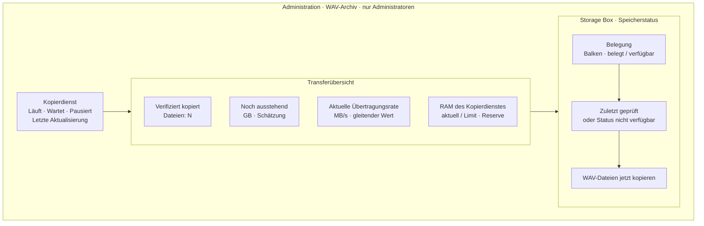

# Admin-Panel: WAV-Kopien und Storage Box

**Status:** Entwurf; keine UI-, API- oder Produktionsänderung vorgenommen.

## Grafischer Seitenaufbau

Die Ansicht liegt unter **Administration → WAV-Archiv**. Kennzahlen erscheinen
als ruhige Karten im bestehenden GreenMind-Stil. Auf schmalen Displays stapeln
sich die Karten einspaltig.



Unter der Archivübersicht bleiben **Kunden & Benutzer** und **Firmen & Zonen**
als eigene Administrationsbereiche erreichbar. Sie sind für normale Konten
weder sichtbar noch über schreibende APIs nutzbar.

## Kennzahlen und Aktualisierung

| Anzeige | Definition |
|---|---|
| Verifiziert kopiert | Anzahl der Dateien mit erfolgreichem Storage-Box-Readback und passendem SHA-256. Versuchte oder teilweise übertragene Dateien zählen nicht. |
| Noch ausstehend (GB) | Geschätzte Bytes katalogisierter WAV-Dateien ohne gültigen Archivbeleg. Kennzeichnung als Schätzung mit Scan-Zeitpunkt; nie aus Queue-Referenzen als Dateizahl ableiten. |
| Übertragungsrate | Tatsächlich bestätigte Bytes pro Zeitfenster, vorzugsweise gleitend über 60 Sekunden. Im Leerlauf „Keine aktive Übertragung“. |
| RAM Kopierdienst | `memory.current` relativ zu `memory.max`; zusätzlich Host-`MemAvailable` und die geltende 20-%-Reserve. Anzeige mindestens alle fünf Sekunden während eines Transfers. |
| Storage-Box-Belegung | Belegte und gesamte Quote/Kapazität als Balken plus Zahlenwert. Wenn die Box keine verlässliche Quote liefert, „Nicht verfügbar“ anzeigen, niemals 0 %. |

Transferstatus, Messzeit und Datenalter sind sichtbar. Echtzeitwerte werden über
SSE/WebSocket oder ein fünfsekündiges Polling aktualisiert; langsame
Speicherquoten dürfen separat höchstens minütlich abgefragt werden. Fehlerhafte
oder veraltete Messwerte werden als **nicht verfügbar** markiert.

## Berechtigungen

- Autorisierung erfolgt serverseitig anhand der zentral konfigurierten
  `MANAGEMENT_ADMIN_EMAILS`-Freigabe und aktiver, bestätigter Konten.
- Administratoren: Übersicht, manueller Kopierstart, Firmen- und Zonenverwaltung.
- Andere Konten: keine Adminnavigation; direkte Admin-API-Aufrufe erhalten 403.
- Adminliste, RAM-/Speicherkennzahlen und Job-Details werden nie öffentlich
  ausgeliefert. Frontend-Verbergen ist nur eine zusätzliche Darstellungsschicht.
- Firmen- und Zonenerstellung, Änderung und Löschung verlangen dieselbe
  serverseitige Adminprüfung. Bestehende Datenintegritätsregeln bleiben bestehen.

## Manueller Kopierstart

Der Button **WAV-Dateien jetzt kopieren** steht ausschließlich innerhalb des
Storage-Box-Abschnitts, unter Belegungsbalken und Prüfzeitpunkt. Er ist während
eines laufenden Jobs deaktiviert und zeigt dessen Fortschritt.

```mermaid
sequenceDiagram
  actor Admin
  participant UI as Admin-Panel
  participant API as Geschützte API
  participant Worker as Isolierter Kopierdienst
  participant Box as Storage Box
  Admin->>UI: „WAV-Dateien jetzt kopieren“
  UI->>Admin: Bestätigung: begrenzter Kopierversuch, keine Löschung
  Admin->>UI: Bestätigen
  UI->>API: POST mit Idempotency-Key
  API->>API: Admin-, Paralleljob- und Ressourcenprüfung
  API->>Worker: Job anfordern oder Konflikt melden
  Worker->>Box: WAV streamen, veröffentlichen, zurücklesen
  Box-->>Worker: Inhalt für SHA-256-Prüfung
  Worker-->>API: verifiziert, pausiert oder fehlgeschlagen
  API-->>UI: Job-ID und Status
  UI-->>Admin: Live-Fortschritt; Original bleibt erhalten
```

Bei erfolgreichem Start zeigt die Oberfläche Job-ID, Startzeit, aktuelle Datei
und bestätigte Zähler. Bei Ressourcenmangel erklärt sie **Pausiert – erneuter
Versuch folgt**, statt Erfolg vorzutäuschen. Ein Doppelklick darf keinen zweiten
Worker starten. Der Vorgang bleibt kopierend: keine lokalen WAVs löschen,
verschieben oder umbenennen.

## Visuelle Leitlinien

- Bestehende `glass-card`-Oberflächen, Grünpalette und Typografie fortführen.
- Grün für bestätigte Übertragung; Amber für Pause/Warnung; Rot nur für Fehler.
- Balken und sparsame Sparklines ergänzen Zahlen, ersetzen sie aber nicht.
- Keine leuchtenden Neonflächen, überladene Tachometer oder Technik-Deko.
- Einheitliche Kartenabstände; Status und Hauptkennzahlen zuerst lesen lassen.
- Kontrast, Tastaturbedienung, Fokusrahmen und beschriftete Fortschrittsanzeigen
  nach WCAG-AA berücksichtigen.

## Implementierungsplatzhalter

| Bereich | Vorgabe / offen |
|---|---|
| UI | Bestehendes Next.js, React und TypeScript; Route `[locale]/app/administration/archive` (Vorschlag). |
| Backend | Bestehende FastAPI-Administration; jede Route mit zentralem Admin-Guard. |
| Vorhandene API | `GET /api/v1/administration/storage` liefert Host-Speicherwerte, nicht automatisch die Storage-Box-Quote. |
| Geplante Status-API | `GET /api/v1/administration/archive/status` — Job, Zähler, offene Bytes, Aktualisierungszeit. |
| Geplante Laufzeitmetriken | `GET /api/v1/administration/archive/metrics` — Rate, cgroup-RAM, RAM-Reserve und Messalter. |
| Geplante Box-API | `GET /api/v1/administration/archive/storagebox` — belegte/gesamte Quote oder explizit nicht verfügbar. |
| Geplanter Start | `POST /api/v1/administration/archive/copy` mit Idempotency-Key; nur begrenzter Kopierjob, keine Löschoption. |
| Echtzeit | SSE bevorzugt; Polling-Fallback alle fünf Sekunden. Zugang ebenfalls Admin-geschützt. |
| Admin-Konfiguration | `<REQUESTER_EMAIL>,<PETER_EMAIL>` in serverseitiger Konfiguration; konkrete Konten vor Umsetzung verifizieren. |

Vor Implementierung sind Storage-Box-Quotenquelle, exakte Admin-Konten, Rate-Definition,
GB-Schätzung und API-Antwortschema festzulegen. Die obigen neuen Endpunkte sind
Vorschläge, keine Aussage über bereits vorhandene Produktionsrouten.
